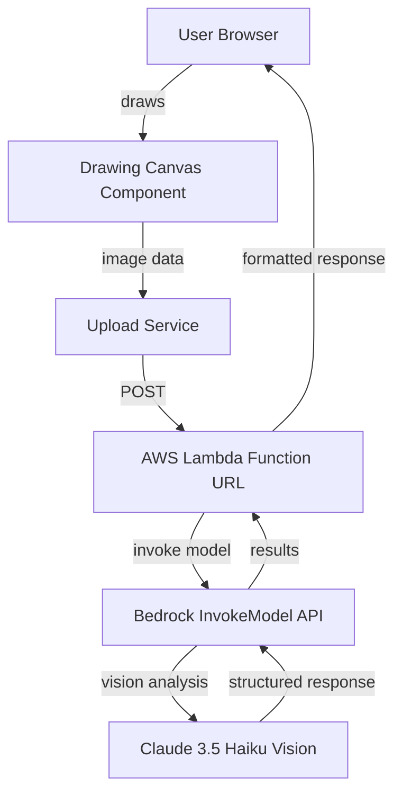

# Design Document

## Overview

The Pokémon Drawing Game is a web application that combines client-side drawing capabilities with cloud-based AI image recognition. The architecture follows a client-server model where the frontend provides an interactive HTML5 canvas for drawing, and the backend leverages AWS services for image storage and AI-powered Pokémon identification.

The system is designed with three primary layers:
1. **Presentation Layer**: A web-based drawing interface built with HTML5 Canvas API
2. **Integration Layer**: AWS Lambda for serverless compute and direct API integration
3. **AI Layer**: AWS Bedrock InvokeModel API with Claude 3.5 Haiku for intelligent Pokémon identification

## Architecture

### High-Level Architecture



### Component Interaction Flow

1. User draws on the HTML5 canvas
2. Canvas converts drawing to image blob (PNG/JPEG)
3. Upload service POSTs image directly to Lambda Function URL
4. Lambda receives image data and invokes Bedrock InvokeModel API
5. Bedrock uses Claude 3.5 Haiku Vision to analyze the image directly
6. Model returns structured response with Pokémon name, confidence score, and reasoning
7. Lambda formats the model response and returns it in HTTP response
8. Frontend receives result and displays to user

## Components and Interfaces

### Frontend Components

#### DrawingCanvas Component
- **Responsibilities**: 
  - Render HTML5 canvas element
  - Handle mouse/touch drawing events
  - Provide drawing tools (brush, eraser, color picker, size selector)
  - Convert canvas to image blob
  - Manage canvas state (clear, reset)
  - Apply Halloween/spooky theme styling

- **Halloween Theme Design**:
  - **Color Palette**:
    - Primary: Deep Purple (#6B46C1, #9333EA)
    - Background: Dark Black (#0F0F0F, #1A1A1A)
    - Accent: Eerie Green (#10B981, #34D399)
    - Text: Light Gray (#E5E7EB) for readability
  - **Visual Effects**:
    - Animated fog/mist using CSS keyframes
    - Purple glow around canvas border
    - Ghost-type Pokémon images (Gengar, Spectrier, Giratina) in header
    - Glowing button effects on hover
    - Spooky font for title (e.g., "Creepster" or "Nosifer" from Google Fonts)

- **Interface**:
```typescript
interface DrawingCanvas {
  initialize(): void;
  clear(): void;
  setTool(tool: DrawingTool): void;
  setBrushSize(size: number): void;
  setColor(color: string): void;
  exportImage(): Promise<Blob>;
}

type DrawingTool = 'brush' | 'eraser';
```

#### UploadService
- **Responsibilities**:
  - POST image blobs to Lambda Function URL
  - Handle upload progress and errors
  - Parse and return AI recognition results
  - Enforce rate limiting per user session

- **Interface**:
```typescript
interface UploadService {
  analyzeImage(imageBlob: Blob): Promise<RecognitionResult>;
  getUploadProgress(): number;
  getRemainingUploads(): number;
  canUpload(): boolean;
}

interface RecognitionResult {
  pokemonName: string;
  confidenceScore: number;
  explanation: string;
  processedAt: Date;
}
```

#### RateLimiter
- **Responsibilities**:
  - Track upload count per user session
  - Enforce maximum uploads per session
  - Provide feedback on remaining uploads

- **Interface**:
```typescript
interface RateLimiter {
  checkLimit(): boolean;
  incrementCount(): void;
  getRemainingCount(): number;
  reset(): void;
}

interface RateLimitConfig {
  maxUploadsPerSession: number;  // Default: 10
  sessionDuration: number;        // Default: 3600000 (1 hour in ms)
}
```

#### ResultsDisplay Component
- **Responsibilities**:
  - Display AI recognition results
  - Show confidence score with visual indicator
  - Present explanation text
  - Provide "Draw Another" action

- **Interface**:
```typescript
interface ResultsDisplay {
  showResults(result: RecognitionResult): void;
  clear(): void;
}

interface RecognitionResult {
  pokemonName: string;
  confidenceScore: number;
  explanation: string;
  imageUrl: string;
}
```

### Backend Components

#### AWS Lambda Function with Function URL
- **Purpose**: Receive images and orchestrate AI recognition
- **Responsibilities**:
  - Receive HTTP POST requests with image data
  - Validate image format and size
  - Invoke Bedrock InvokeModel API for analysis
  - Format and return results synchronously
  - Handle errors and timeouts
- **Function URL Configuration**:
  - CORS enabled for CloudFront origin
  - Auth type: NONE (public access with rate limiting)
  - Invoke mode: BUFFERED (for synchronous responses)
- **Cost Optimization**:
  - Free tier: 1 million requests per month, 400,000 GB-seconds of compute time
  - Configured with minimal memory (512MB) to reduce costs
  - Timeout set to 30 seconds to prevent runaway costs

- **Interface**:
```typescript
interface LambdaHandler {
  handler(event: LambdaFunctionURLEvent): Promise<LambdaFunctionURLResult>;
}

interface LambdaFunctionURLEvent {
  body: string;  // Base64 encoded image data
  headers: Record<string, string>;
  requestContext: {
    http: {
      method: string;
      path: string;
    };
  };
}

interface LambdaFunctionURLResult {
  statusCode: number;
  headers: Record<string, string>;
  body: string;  // JSON stringified RecognitionResult
}
```

#### AI Recognition Service (Bedrock InvokeModel)
- **Purpose**: Analyze images and identify Pokémon using direct model invocation
- **Implementation**: AWS Bedrock InvokeModel API with Claude 3.5 Haiku Vision model
- **Model Configuration**:
  - **Model ID**: `anthropic.claude-3-5-haiku-20241022-v1:0`
  - **Vision Capabilities**: Native image analysis support
  - **System Prompt**: "You are a Pokémon identification expert. When given an image of a drawing, analyze it and identify which Pokémon was drawn. Respond with JSON containing: pokemonName (string), confidenceScore (0-100 number), and explanation (string describing visual features)."
  - **Max Tokens**: 1000
  - **Temperature**: 0.3 (for consistent responses)
  
- **Direct Model Workflow**:
  1. Lambda receives image data from client
  2. Lambda converts image to base64 format
  3. Lambda calls Bedrock InvokeModel API with image and prompt
  4. Model analyzes image and returns JSON response
  5. Lambda parses and validates response
  6. Lambda returns formatted result to client

- **Cost Optimization**:
  - Claude 3.5 Haiku: ~$0.0004 per image analysis (input tokens) + ~$0.002 per response (output tokens)
  - Direct API calls: No agent overhead or additional processing costs
  - Set maximum image size to 1MB to reduce processing costs
  - Implement response caching for identical images (optional)

- **Interface**:
```typescript
interface BedrockInvokeModelService {
  invokeModel(imageData: Buffer, prompt: string): Promise<ModelResponse>;
}

interface ModelResponse {
  pokemonName: string;
  confidenceScore: number;
  explanation: string;
}

interface InvokeModelParams {
  modelId: string;
  contentType: 'application/json';
  accept: 'application/json';
  body: {
    anthropic_version: 'bedrock-2023-05-31';
    max_tokens: number;
    temperature: number;
    system: string;
    messages: Array<{
      role: 'user';
      content: Array<{
        type: 'image' | 'text';
        source?: {
          type: 'base64';
          media_type: string;
          data: string;
        };
        text?: string;
      }>;
    }>;
  };
}
```

## Data Models

### Drawing Image
```typescript
interface DrawingImage {
  id: string;              // Unique identifier (UUID)
  s3Key: string;           // S3 object key
  format: 'png' | 'jpeg';  // Image format
  uploadedAt: Date;        // Upload timestamp
  size: number;            // File size in bytes
}
```

### Recognition Result
```typescript
interface RecognitionResult {
  imageId: string;         // Reference to drawing image
  pokemonName: string;     // Identified Pokémon name
  confidenceScore: number; // 0-100 percentage
  explanation: string;     // AI reasoning
  processedAt: Date;       // Processing timestamp
}
```

### Error Response
```typescript
interface ErrorResponse {
  error: string;           // Error type
  message: string;         // User-friendly message
  details?: string;        // Technical details (optional)
  timestamp: Date;         // Error timestamp
}
```

## Correctness Properties

*A property is a characteristic or behavior that should hold true across all valid executions of a system—essentially, a formal statement about what the system should do. Properties serve as the bridge between human-readable specifications and machine-verifiable correctness guarantees.*

### Property 1: Tool selection enables drawing
*For any* drawing tool (brush or eraser), when selected, subsequent drawing events should produce visible changes on the canvas.
**Validates: Requirements 1.2**

### Property 2: Canvas to image conversion produces valid format
*For any* canvas state with drawing content, exporting the image should produce a valid blob in PNG or JPEG format that can be decoded.
**Validates: Requirements 2.1**

### Property 3: Image submission returns AI recognition result
*For any* valid image blob, when submitted to the Lambda Function URL, the response should contain a complete recognition result with Pokémon name, confidence score, and explanation.
**Validates: Requirements 2.2, 2.5, 3.2, 3.3, 3.4, 3.5**

### Property 4: Upload progress shows loading indicator
*For any* upload operation in progress, the UI should display a loading indicator until the operation completes or fails.
**Validates: Requirements 2.3**

### Property 5: Failed upload provides retry capability
*For any* upload that fails, the system should display an error message and provide a retry mechanism.
**Validates: Requirements 2.4**

### Property 6: AI service returns complete recognition result
*For any* image analyzed by the AI Recognition Service, the response should contain a Pokémon name (non-empty string), a confidence score between 0 and 100, and an explanation (non-empty string).
**Validates: Requirements 3.2, 3.3, 3.4, 3.5**

### Property 7: Results display shows all recognition data
*For any* recognition result received, the UI should display the Pokémon name, confidence score as a percentage, and the explanation text.
**Validates: Requirements 4.1, 4.2, 4.3**

### Property 8: Clear button empties canvas
*For any* canvas state with drawing content, clicking the clear button should result in an empty canvas with no visible marks.
**Validates: Requirements 5.2**

### Property 9: Clear resets tool settings
*For any* modified tool settings (color, brush size), clearing the canvas should reset all settings to their default values.
**Validates: Requirements 5.3**

### Property 10: Lambda communication uses HTTPS
*For any* request to the Lambda Function URL, the URL should use the HTTPS protocol.
**Validates: Requirements 6.1**

### Property 12: Error logs exclude credentials
*For any* authentication error, the logged error message should not contain AWS credentials, access keys, or secret keys.
**Validates: Requirements 6.5**

### Property 13: Errors produce user-friendly messages
*For any* error condition (network failure, timeout, service error, initialization failure), the system should display a user-friendly error message to the player and log technical details separately.
**Validates: Requirements 8.1, 8.2, 8.3, 8.4, 8.5**

### Property 14: Rate limit enforced per session
*For any* user session, after reaching the maximum number of allowed uploads, subsequent upload attempts should be rejected with a rate limit message.
**Validates: Requirements 7.3, 7.4**

### Property 15: Upload count tracking is accurate
*For any* sequence of uploads within a session, the remaining upload count should decrease by one for each successful upload and accurately reflect the number of uploads remaining.
**Validates: Requirements 7.3**

### Property 16: CORS policy restricts unauthorized domains
*For any* request from an origin not matching the allowed domain list, the Lambda Function URL should reject the request with a CORS error.
**Validates: Requirements 8.3, 8.4**

## Hosting and Deployment

### Infrastructure as Code (IaC)

**AWS SAM (Serverless Application Model)**
- All infrastructure defined in `template.yaml`
- Includes: Lambda function, IAM roles, CloudWatch alarms, S3 bucket, CloudFront distribution
- Deployment: `sam build && sam deploy`
- Benefits: Repeatable, version-controlled, easy to tear down

**SAM Template Structure**:
```yaml
Resources:
  PokemonLambda:           # Lambda function with Function URL
  LambdaExecutionRole:     # IAM role with Bedrock InvokeModel permissions
  HighInvocationAlarm:     # CloudWatch alarm for traffic
  CostProtectionAlarm:     # CloudWatch alarm for Bedrock costs
  ErrorRateAlarm:          # CloudWatch alarm for errors
  AlarmTopic:              # SNS topic for notifications
  FrontendBucket:          # S3 bucket for static files
  CloudFrontDistribution:  # CDN for global distribution
```

### Hosting Architecture

**AWS S3 + CloudFront (deployed via SAM)**
- **S3 Static Website Hosting**: Host HTML/CSS/JS files
- **CloudFront CDN**: Global distribution with HTTPS
- **Free Tier Benefits**:
  - S3: 5GB storage, 20,000 GET requests, 2,000 PUT requests per month
  - CloudFront: New flat-rate Free plan (Nov 2024) - 1M requests, 100GB transfer/month, no overages
  - No custom domain needed - use CloudFront distribution URL (e.g., `d123456.cloudfront.net`)
  
**Deployment Flow**:
```
1. sam build && sam deploy          → Deploy infrastructure
2. npm run build                    → Build frontend
3. aws s3 sync dist/ s3://bucket    → Upload to S3
4. CloudFront serves to users       → HTTPS delivery
```

### HTTPS Configuration

- CloudFront provides free SSL/TLS certificate for `.cloudfront.net` domain
- All traffic forced to HTTPS via CloudFront distribution settings
- No custom domain required (saves $12/year for domain registration)

## Security Architecture

### Authentication and Authorization

**Lambda Function URL Security**:
- Public endpoint (no AWS authentication required)
- CORS configured to allow only CloudFront origin
- Rate limiting enforced client-side (localStorage)
- Content validation in Lambda (image format, size)

**CORS Configuration**:
```typescript
interface LambdaCORSConfig {
  allowedOrigins: ['https://d123456.cloudfront.net'];  // Replace with actual CloudFront domain
  allowedMethods: ['POST'];
  allowedHeaders: ['Content-Type'];
  maxAge: 3600;
}
```

### Request Validation

**Client-Side**:
- Validate image size before upload (max 1MB)
- Check rate limit before sending request
- Use fetch API with proper headers

**Server-Side (Lambda)**:
- Validate Content-Type header
- Validate image format (PNG/JPEG only)
- Validate image size (max 1MB)
- Validate image dimensions (100x100 to 2000x2000 pixels)
- Return 400 Bad Request for invalid inputs

### Protection Against Abuse

**Rate Limiting** (Client-Side):
- 10 uploads per session (localStorage)
- Session expires after 1 hour

**Rate Limiting** (Server-Side):
- Lambda checks upload frequency per Cognito identity
- DynamoDB table tracks upload counts (optional, for stricter limits)
- Reject requests exceeding threshold

**Content Validation**:
- Lambda validates image format (PNG/JPEG only)
- Maximum file size: 1MB
- Image dimensions: 100x100 to 2000x2000 pixels
- Reject non-image files

**Cost Protection**:
- Client-side rate limiting (10 uploads per session)
- Lambda timeout prevents runaway costs (30 seconds)
- Bedrock Agent invocation timeout: 30 seconds
- No storage costs (images not persisted)

### Security Best Practices

1. **No Hardcoded Credentials**: All credentials via environment variables or AWS Secrets Manager
2. **Least Privilege**: IAM roles grant minimum necessary permissions
3. **Encryption**: Data encrypted in transit (HTTPS) and at rest (S3 encryption)
4. **Monitoring**: CloudWatch logs for all Lambda invocations and S3 access
5. **Audit Trail**: CloudTrail enabled for AWS API calls

## Cost Optimization Strategy

### AWS Free Tier Utilization

**CloudFront CDN**:
- New flat-rate Free tier (announced Nov 2024): 1 million requests, 100GB data transfer per month
- No overage charges - performance may be reduced if limits exceeded
- Includes: CDN, DDoS protection, Route 53 DNS, CloudWatch Logs
- Expected usage: ~500KB per page load × 200 visits = 100MB transfer (well within limits)
- Cost: $0/month

**Lambda Compute**:
- Free tier: 1 million requests, 400,000 GB-seconds compute per month
- Strategy: Use 512MB memory allocation, 30-second timeout
- Expected usage: 2,000 invocations × 5 seconds × 0.5GB = 5,000 GB-seconds (well within limits)
- Lambda Function URL: No additional cost
- Cost: $0/month

**Bedrock InvokeModel Service**:
- Claude 3.5 Haiku: ~$0.0004 per image analysis (input) + ~$0.002 per response (output)
- Direct API calls: No agent overhead
- Expected cost: 2,000 requests × $0.0024 = $4.80 per month

**CloudWatch**:
- Free tier: 10 custom metrics, 10 alarms, 5GB log ingestion, 5GB log storage
- Expected usage: 3 alarms, 2 custom metrics, 1GB logs
- Cost: $0/month

**Total Estimated Monthly Cost**: $4.80 (Bedrock InvokeModel only)

### Rate Limiting Implementation

**Session-Based Limits**:
- Maximum 10 uploads per user session
- Session duration: 1 hour (stored in browser localStorage)
- Reset mechanism: Clear localStorage or wait for session expiration

**Rate Limit Feedback**:
- Display remaining uploads counter in UI
- Show friendly message when limit reached: "You've reached your upload limit for this session. Try again in [time remaining]."
- Provide visual indicator (progress bar or counter) showing uploads used

**Cost Protection**:
- Hard limit prevents runaway costs from automated abuse
- Estimated maximum monthly cost: $4.80 (assuming 2,000 uploads at free tier limits)
- No database required for rate limiting (client-side localStorage)

### CloudWatch Monitoring and Alarms

**Metrics to Monitor**:
1. **Lambda Invocation Count**: Number of times the Lambda function is invoked
2. **Bedrock InvokeModel Count**: Number of direct model invocations
3. **Lambda Error Rate**: Percentage of failed Lambda invocations
4. **Lambda Duration**: Average execution time
5. **HTTP 4xx/5xx Errors**: Client and server error rates

**CloudWatch Alarms**:

**Alarm 1: High Lambda Invocation Volume**
- Metric: Lambda Invocations count
- Threshold: > 1,500 invocations per day
- Action: Send SNS notification to admin email
- Purpose: Detect potential abuse or unexpected traffic spike

**Alarm 2: Bedrock Cost Protection**
- Metric: Bedrock InvokeModel count
- Threshold: > 2,000 invocations per month
- Action: Send SNS notification to admin email
- Purpose: Prevent exceeding budget ($4.80/month)

**Alarm 3: Lambda Error Rate**
- Metric: Lambda Errors / Lambda Invocations
- Threshold: > 10% error rate
- Action: Send SNS notification to admin email
- Purpose: Detect system issues or bugs

**SNS Configuration**:
```typescript
interface SNSAlarmConfig {
  topicName: 'pokemon-game-alerts';
  subscriptions: [
    {
      protocol: 'email';
      endpoint: 'admin@example.com';
    }
  ];
}
```

**CloudWatch Dashboard**:
- Real-time view of upload count, Lambda invocations, and costs
- Daily/weekly/monthly aggregations
- Error logs and traces for debugging

## Error Handling

### Client-Side Error Handling

**Canvas Initialization Errors**
- Detect browser compatibility issues with HTML5 Canvas
- Display fallback message if canvas is not supported
- Log technical details to console for debugging

**Drawing Errors**
- Handle invalid tool selections gracefully
- Catch and log canvas rendering exceptions
- Prevent application crash on drawing errors

**Upload Errors**
- Network timeout: Retry with exponential backoff (3 attempts)
- File size exceeded: Display size limit message
- Invalid image format: Validate before upload
- S3 access denied: Display authentication error

### Server-Side Error Handling

**Lambda Function Errors**
- S3 access errors: Log and return 500 status
- AI service timeout: Return timeout error after 30 seconds
- Invalid image data: Return 400 bad request
- Unhandled exceptions: Log stack trace and return generic error

**AI Service Errors**
- Model not available: Return service unavailable error
- Invalid image format: Return format error
- Low confidence (< 20%): Return "Unable to identify" message
- Rate limiting: Implement exponential backoff

### Error Response Format

All errors returned to the client follow this structure:
```typescript
{
  error: string;        // Error type: "NetworkError", "TimeoutError", etc.
  message: string;      // User-friendly message
  timestamp: Date;      // ISO 8601 timestamp
  retryable: boolean;   // Whether retry is recommended
}
```

## Testing Strategy

### Unit Testing

The application will use **Vitest** as the testing framework for unit tests, leveraging its fast execution and Vue.js integration.

**Frontend Unit Tests**:
- DrawingCanvas component: Test tool selection, color changes, brush size adjustments
- UploadService: Test image blob creation, unique ID generation
- ResultsDisplay component: Test result rendering with mock data
- Error handling: Test error message display for specific error types

**Backend Unit Tests**:
- Lambda handler: Test S3 event parsing, response formatting
- AI service integration: Test request/response handling with mocked AI responses
- Error handling: Test specific error scenarios (timeout, invalid data)

### Property-Based Testing

The application will use **fast-check** as the property-based testing library for JavaScript/TypeScript.

**Configuration**:
- Each property-based test will run a minimum of 100 iterations
- Tests will use fast-check's built-in generators and custom generators for domain-specific data
- Each test will be tagged with a comment referencing the correctness property from this design document

**Tagging Format**:
```typescript
// Feature: pokemon-drawing-game, Property 1: Tool selection enables drawing
```

**Property Test Coverage**:
- Each correctness property listed above will be implemented as a single property-based test
- Tests will generate random valid inputs to verify properties hold across all cases
- Custom generators will be created for: drawing tools, canvas states, image blobs, recognition results

**Example Property Test Structure**:
```typescript
import fc from 'fast-check';

// Feature: pokemon-drawing-game, Property 6: AI service returns complete recognition result
test('AI recognition returns complete result', () => {
  fc.assert(
    fc.property(
      fc.uint8Array({ minLength: 100, maxLength: 10000 }), // Random image data
      async (imageData) => {
        const result = await aiService.recognizePokemon(Buffer.from(imageData));
        
        expect(result.pokemonName).toBeTruthy();
        expect(result.pokemonName.length).toBeGreaterThan(0);
        expect(result.confidence).toBeGreaterThanOrEqual(0);
        expect(result.confidence).toBeLessThanOrEqual(100);
        expect(result.reasoning).toBeTruthy();
        expect(result.reasoning.length).toBeGreaterThan(0);
      }
    ),
    { numRuns: 100 }
  );
});
```

### Integration Testing

- End-to-end flow: Draw → Upload → Recognize → Display
- AWS integration: Test actual S3 upload and Lambda invocation (using test bucket)
- AI service integration: Test with sample Pokémon drawings

### Test Environment

- **Local Development**: Mock AWS services using LocalStack or AWS SDK mocks
- **CI/CD**: Automated test execution on every commit
- **Staging**: Integration tests against real AWS services in isolated environment
